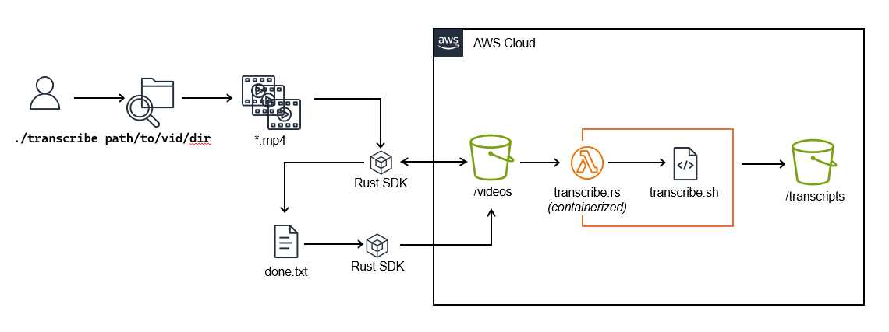

# AWS Transcriber

Pipeline to transcribe videos using S3 x Lambda x Whisper.cpp



Jump To:
* [PreReqs](#prereqs)
* [Provision S3 Resources](#provision-s3-resources)
* [Configure Env Vars](#configure-env-vars)
* [Configure Roles & Permissions](#configure-roles--permissions)
* [Configure Local AWS Credentials](#configure-local-aws-credentials)
* [Deploy Transcriber Function](#deploy-transcriber-function)
* [Configure Step Function](#configure-step-function)
* [Deploy Listener Function](#deploy-listener-function)
* [Configure Listener Trigger](#configure-listener-trigger)
* [Build Transcribe Binary](#build-transcribe-binary)
* [Run E2E Transcription Pipeline](#run-e2e-transcription-pipeline)
* [Testing](#testing)
* [Gotchas & Debugging](#gotchas--debugging)

### PreReqs

**Install AWS CLI v2**

Refer to the latest install [docs](https://docs.aws.amazon.com/cli/latest/userguide/getting-started-install.html)

```
# Check if installed
$ aws --version

# Install 
$ curl "https://awscli.amazonaws.com/awscli-exe-linux-x86_64.zip" -o "awscliv2.zip"
$ unzip awscliv2.zip
$ sudo ./aws/install
```

**Install cargo-lambda**

```
$ make cargo-lambda
```

⚠️ Ensure all resources are provisioned in the same AWS region ⚠️

### Provision S3 Resources

S3 console > Create Bucket > Allocate 2 buckets: one for video inputs the other for transcript outputs i.e. `videos` and `transcripts` 

NB: Buckets must adhere to global naming rules

### Configure env vars

Create a `.env` file and add AWS account ID and bucket variable values

```
# .env

AWS_ACCT_ID=<YOUR_AWS_ACCT_ID>
AWS_DEFAULT_REGION=<YOUR_AWS_REGION>
VIDEO_BUCKET=<YOUR_S3_VIDEO_BUCKET>
TRANSCRIPT_BUCKET=<YOUR_S3_TRANSCRIPT_BUCKET>
```

### Configure Roles & Permissions

**Create policy `transcribe-lambda-deploy`**

IAM console > Policies > Create Policy > JSON

NB: Replace {AWS-ACCT-ID} with your account ID

```
{
    "Version": "2012-10-17",
    "Statement": [
        {
            "Effect": "Allow",
            "Action": [
                "iam:CreateRole",
                "iam:AttachRolePolicy",
                "iam:UpdateAssumeRolePolicy",
                "iam:PassRole"
            ],
            "Resource": [
                "arn:aws:iam::{AWS-ACCT-ID}:role/AWSLambdaBasicExecutionRole",
                "arn:aws:iam::{AWS-ACCT-ID}:role/transcriber-fxn-role*",
                "arn:aws:iam::{AWS-ACCT-ID}:role/listener-fxn-role*"
            ]
        },
        {
            "Effect": "Allow",
            "Action": [
                "lambda:CreateFunction",
                "lambda:UpdateFunctionCode",
                "lambda:UpdateFunctionConfiguration",
                "lambda:GetFunction",
                "lambda:InvokeFunction"
            ],
            "Resource": "*"
        },
        {
            "Effect": "Allow",
            "Action": [
				"ecr:GetAuthorizationToken",
				"ecr:SetRepositoryPolicy",
                "ecr:GetDownloadUrlForLayer",
                "ecr:BatchGetImage",
                "ecr:CompleteLayerUpload",
                "ecr:DescribeImages",
                "ecr:DescribeRepositories",
                "ecr:UploadLayerPart",
                "ecr:ListImages",
                "ecr:InitiateLayerUpload",
                "ecr:BatchCheckLayerAvailability",
                "ecr:GetRepositoryPolicy",
                "ecr:PutImage",
                "ecr:CreateRepository"
            ],
            "Resource": "*"
        }
    ]
}
```

**Create user `transcribe-lambda-developer`**

IAM console > Users > Create User > Attach Policies Directly: `transcribe-lambda-deploy`, `AWSStepFunctionsFullAccess`

**Create policy `logging-policy`**

IAM console > Policies > Create Policy > JSON

```
{
    "Version": "2012-10-17",
    "Statement": [
        {
            "Effect": "Allow",
            "Action": [
                "logs:PutLogEvents",
                "logs:CreateLogGroup",
                "logs:CreateLogStream"
            ],
            "Resource": "arn:aws:logs:*:*:*"
        }
    ]
}
```

**Create role `trancriber-fxn-role`**

IAM console > Roles > Create Role > AWS Service: Lambda > Permissions: `logging-policy`, `AmazonS3FullAccess`

**Create role `listener-fxn-role`**

IAM console > Roles > Create Role > AWS Service: Lambda > Permissions: `logging-policy`, `AWSStepFunctionsFullAccess`

**Create user `transcribe`**

IAM console > Users > Create User > Attach Policies Directly: `AmazonS3FullAccess`, `AmazonEC2FullAccess`

### Configure Local AWS Credentials

Create Access Key for `transcribe` > add to default `~/.aws/credentials` profile:

```
[default]
aws_access_key_id=<TRANSCRIBE_ACCESS_KEY>
aws_secret_access_key=<TRANSCRIBE_SECRET_KEY>
```

Create Access Key for `transcribe-lambda-developer` > add new `~/.aws/credentials` profile:

```
[transcribe-lambda-dev]
aws_access_key_id=<TRANSCRIBE_LAMBDA_DEVELOPER_ACCESS_KEY>
aws_secret_access_key=<TRANSCRIBE_LAMBDA_DEVELOPER_SECRET_KEY>
```

### Deploy Transcriber Function

**Build transcriber function (image)**

```
# cd lambda-fxns/transcriber
$ make build-image
```

**Push Container Image to ECR**

```
# Login
$ make ecr-login

# Make ECR Repo if DNE
$ make ecr-repo

# Push to ECR
$ make ecr-push
```

**Deploy containerized transcriber function**

```
$ make deploy-lambda
```

### Configure Step Function

1. Step Function console > Create state machine > Code editor
2. Copy `lambda-fxns/transcriber/statemachine.json` and update `${AWS_DEFAULT_REGION}`, `${AWS_ACCT_ID}`, `${VIDEO_BUCKET}` placeholders
3. Config > State machine name: transcribe-machine > Create
4. Add `STATE_MACHINE_ARN=<TRANSCRIBE_MACHINE_ARN>` to `.env`

### Deploy Listener Function

**Deploy listener function (.zip)**

```
# cd lambda-fxns/listener
$ make deploy-zip
```

### Configure Listener Trigger

Lambda console > transcriber > Add Trigger > S3 > Bucket: whisper-videos > Event types: PUT > Add

### Build Transcribe Binary

```
# cd transcribe
$ make binary
```

### Run E2E Transcription Pipeline

```
# cd transcribe
$ ./target/release/transcribe <path/to/vid_dir>
```

NB: relies on well-formed directory structure

```
path/to/vid_dir/
    |-- week1
        |-- lesson1
            |-- video0.mp4
            |-- video1.mp4
            ...
        |-- lesson2
            |-- video0.mp4
            |-- video1.mp4  
            ...
        ...
    |-- week2
        ...
    |-- week3
        ...
```

### Testing

**Run unit tests**

```
# cd transcribe
$ make tests
```

### Gotchas & Debugging

**Test transcriber image locally**

```
# Install AWS Lambda Runtime Emulator
$ make install-emulator

# Launch container on emulator
$ make local-container

# Send test payload using curl
$ curl -XPOST "http://localhost:9000/2015-03-31/functions/function/invocations" -d '{TEST PAYLOAD}'
```

### To Do

* [ ] Parallelize file ops w/ Rayon

### References
* [Deploying Lambda Containers](https://docs.aws.amazon.com/lambda/latest/dg/images-create.html)
* [Lambda Runtime Emulator](https://github.com/aws/aws-lambda-runtime-interface-emulator)
* [AWS S3 x Lambda Example](https://docs.aws.amazon.com/lambda/latest/dg/with-s3-example.html#with-s3-example-create-bucket)
* [Cargo Lambda Docs](https://www.cargo-lambda.info/)