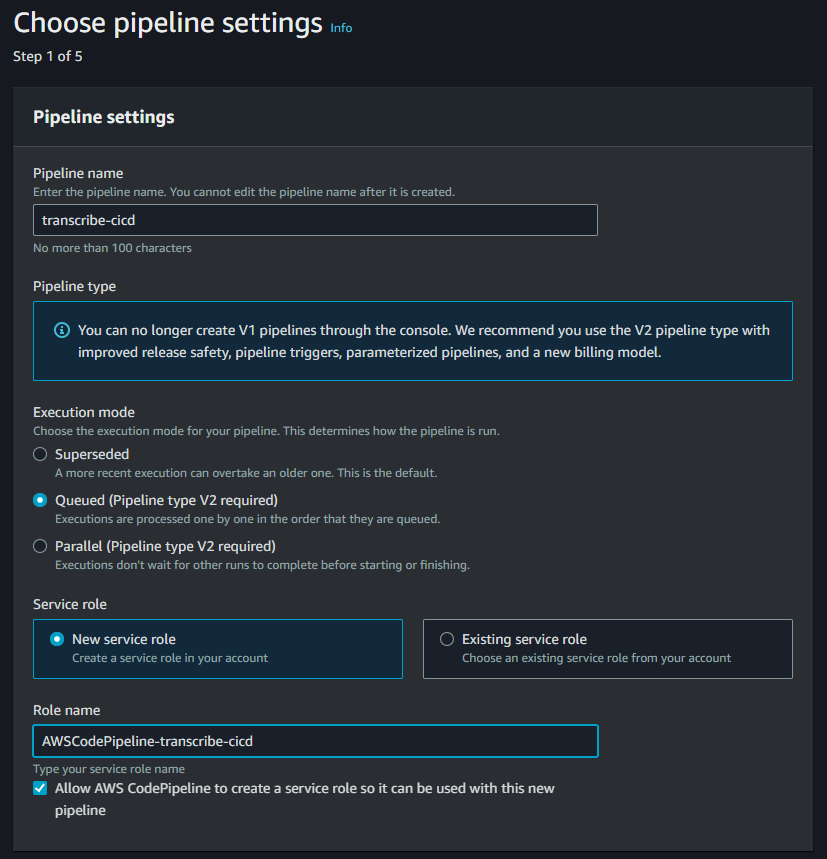

# Transcribe

Serverless E2E workflow to transcribe videos using Rust x AWS x Whisper.cpp


The workflow consists of 3 core elements:
1. Rust CLI Tool to upload local video directory
2. Serverless transcription pipeline (Lambda + Step Functions)
3. CI/CD Pipeline (CodeBuild + CodePipeline)

---

## Getting Started

**Install Rust**

Refer to the latest [rustup docs](https://rustup.rs/)

```
$ curl --proto '=https' --tlsv1.2 -sSf https://sh.rustup.rs | sh -s -- -y --profile minimal --default-toolchain stable
$ . "$HOME/.cargo/env"
```

**Install AWS CLI v2**

Refer to the latest [AWS docs](https://docs.aws.amazon.com/cli/latest/userguide/getting-started-install.html)

```
# Check if installed
$ aws --version

# Install 
$ curl "https://awscli.amazonaws.com/awscli-exe-linux-x86_64.zip" -o "awscliv2.zip"
$ unzip awscliv2.zip
$ sudo ./aws/install
```

**Clone or Fork Repo**

```
$ git clone https://github.com/athletedecoded/transcribe.git
```

**Install cargo-lambda**

```
# cd transcribe
$ make cargo-lambda
$ . $HOME/.bashrc
```

---

## Developer Docs

⚠️ Ensure all resources are provisioned in the same AWS region ⚠️

Jump To:
* [Provision S3 Resources](#provision-s3-resources)
* [Configure Roles & Permissions](#configure-roles--permissions)
* [Configure Environment & Credentials](#configure-environment--credentials)
* [Deploy Transcriber Function](#deploy-transcriber-function)
* [Configure Step Function](#configure-step-function)
* [Deploy Listener Function](#deploy-listener-function)
* [Configure Listener Trigger](#configure-listener-trigger)
* [Build Transcribe Binary](#build-transcribe-binary)
* [Run E2E Transcription Pipeline](#run-e2e-transcription-pipeline)
* [Testing & Debugging](#testing--debugging)
* [Transcriber Memory Management](#transcriber-memory-management)
* [Modifying & Updating Transcriber Pipeline](#modifying--updating-transcriber)
* [Configure CI/CD Pipeline](#configure-cicd-pipeline)

--- 

### Provision S3 Resources

S3 console > Create Bucket > Allocate 2 buckets: 
1. One for video inputs i.e. 'videos'
2. One for transcript outputs i.e. 'transcripts'

NB: Buckets must adhere to global naming rules

--- 

### Configure Roles & Permissions

**Create policy `transcribe-lambda-deploy`**

IAM console > Policies > Create Policy > JSON

NB: Replace {AWS-ACCT-ID} with your account ID

```
{
    "Version": "2012-10-17",
    "Statement": [
        {
            "Effect": "Allow",
            "Action": [
                "iam:CreateRole",
                "iam:AttachRolePolicy",
                "iam:UpdateAssumeRolePolicy",
                "iam:PassRole"
            ],
            "Resource": [
                "arn:aws:iam::{AWS-ACCT-ID}:role/AWSLambdaBasicExecutionRole",
                "arn:aws:iam::{AWS-ACCT-ID}:role/transcriber-fxn-role*",
                "arn:aws:iam::{AWS-ACCT-ID}:role/listener-fxn-role*"
            ]
        },
        {
            "Effect": "Allow",
            "Action": [
                "lambda:CreateFunction",
                "lambda:UpdateFunctionCode",
                "lambda:UpdateFunctionConfiguration",
                "lambda:GetFunction",
                "lambda:InvokeFunction"
            ],
            "Resource": "*"
        },
        {
            "Effect": "Allow",
            "Action": [
                "ecr:GetAuthorizationToken",
                "ecr:SetRepositoryPolicy",
                "ecr:GetDownloadUrlForLayer",
                "ecr:BatchGetImage",
                "ecr:CompleteLayerUpload",
                "ecr:DescribeImages",
                "ecr:DescribeRepositories",
                "ecr:UploadLayerPart",
                "ecr:ListImages",
                "ecr:InitiateLayerUpload",
                "ecr:BatchCheckLayerAvailability",
                "ecr:GetRepositoryPolicy",
                "ecr:PutImage",
                "ecr:CreateRepository"
            ],
            "Resource": "*"
        }
    ]
}
```

**Create policy `logging-policy`**

IAM console > Policies > Create Policy > JSON

```
{
    "Version": "2012-10-17",
    "Statement": [
        {
            "Effect": "Allow",
            "Action": [
                "logs:PutLogEvents",
                "logs:CreateLogGroup",
                "logs:CreateLogStream"
            ],
            "Resource": "arn:aws:logs:*:*:*"
        }
    ]
}
```

**Create role `trancriber-fxn-role`**

IAM console > Roles > Create Role > AWS Service: Lambda > Permissions: `logging-policy`, `AmazonS3FullAccess`

**Create role `listener-fxn-role`**

IAM console > Roles > Create Role > AWS Service: Lambda > Permissions: `logging-policy`, `AWSStepFunctionsFullAccess`

**Create role `cleanup-fxn-role`**

IAM console > Roles > Create Role > AWS Service: Lambda > Permissions: `logging-policy`, `AmazonS3FullAccess`

**Create user `transcribe`**

IAM console > Users > Create User > Attach Policies Directly: `AmazonS3FullAccess`, `AmazonEC2FullAccess`

**Create user `transcribe-lambda-developer`**

IAM console > Users > Create User > Attach Policies Directly: `transcribe-lambda-deploy`, `AWSStepFunctionsFullAccess`

--- 

### Configure Environment & Credentials

**Set Environment Variables**

In `sample.env` add AWS account ID, default region, and bucket variable values

```
# sample.env

AWS_ACCT_ID=<YOUR_AWS_ACCT_ID>
AWS_DEFAULT_REGION=<YOUR_AWS_REGION>
VIDEO_BUCKET=<YOUR_S3_VIDEO_BUCKET>
TRANSCRIPT_BUCKET=<YOUR_S3_TRANSCRIPT_BUCKET>
```

Move/rename `sample.env` to `.env`

```
$ mv sample.env .env
```

**Set AWS Credentials**

In `sample.credentials` configure AWS credential profiles:

1. Create Access Key for user `transcribe` > set as default profile

```
[default]
aws_access_key_id=<TRANSCRIBE_ACCESS_KEY>
aws_secret_access_key=<TRANSCRIBE_SECRET_KEY>
```

2. Create Access Key for user `transcribe-lambda-developer` > set as transcribe-lambda-dev profile

```
[transcribe-lambda-dev]
aws_access_key_id=<TRANSCRIBE_LAMBDA_DEVELOPER_ACCESS_KEY>
aws_secret_access_key=<TRANSCRIBE_LAMBDA_DEVELOPER_SECRET_KEY>
```

Move `sample.credentials` to `~/.aws/credentials`

```
$ mv sample.credentials ~/.aws/credentials
```

--- 

### Deploy Containerized Transcriber Function

**Build whisper.cpp**

```
# cd lambda-fxns/transcriber
$ git clone https://github.com/ggerganov/whisper.cpp.git
$ cd whisper.cpp 
$ make
$ ./models/download-ggml-model.sh base.en
```

**Build transcriber function**

```
$ make image
```

**Push Image to ECR**

```
# Login
$ make ecr-login

# Make ECR Repo if DNE
$ make ecr-repo

# Push to ECR
$ make ecr-push
```

**Deploy transcriber function**

```
$ make deploy-lambda
```

--- 

### Configure Step Function

1. Step Function console > Create state machine > Code editor
2. Copy `lambda-fxns/transcriber/statemachine.json` and update `${AWS_DEFAULT_REGION}`, `${AWS_ACCT_ID}`, `${VIDEO_BUCKET}` placeholders
3. Config > State machine name: transcribe-pipeline > Create
4. Add `STATE_MACHINE_ARN=<TRANSCRIBE_MACHINE_ARN>` to `.env`

--- 

### Deploy Listener Function

**Deploy listener function (.zip)**

```
# cd lambda-fxns/listener
$ make deploy-zip
```

--- 

### Deploy Cleanup Function

**Deploy cleanup function (.zip)**

```
# cd lambda-fxns/cleanup
$ make deploy-zip
```

--- 

### Configure Listener Trigger

Lambda console > listener > Add Trigger > S3 > Bucket: videos > Event types: PUT > Add

--- 

### Build or Download Transcribe Binary

**Option 1: Build from Source**

```
# cd transcribe
$ make binary
```

**Option 2: Download Binary**

Download the latest release [here](https://github.com/athletedecoded/transcribe/releases)

--- 

### Run E2E Transcription Pipeline

```
# cd transcribe
$ ./target/release/transcribe <path/to/vid_dir>
```

NB: vid_dir must adhere to well-formed directory structure

```
path/to/vid_dir/
    |-- week1
        |-- lesson1
            |-- video0.mp4
            |-- video1.mp4
            ...
        |-- lesson2
            |-- video0.mp4
            |-- video1.mp4  
            ...
        ...
    |-- week2
        ...
    |-- week3
        ...
```

--- 

### Testing & Debugging

**Run unit tests**

```
# cd transcribe
$ make test
```

**Test transcriber image locally**

```
# Install AWS Lambda Runtime Emulator
$ make install-emulator

# Launch container on emulator
$ make local-container

# Send sample payload using curl i.e.
$ curl -XPOST "http://localhost:9000/2015-03-31/functions/function/invocations" -d '{
  "Items": [
    {
      "Etag": "\"d41d8cd98f00b204e9800998ecf8427e\"",
      "Key": "done.txt",
      "LastModified": 1722541000,
      "Size": 0,
      "StorageClass": "STANDARD"
    },
    {
      "Etag": "\"d9221b8cfeaae16e0d50dd70369e15e1\"",
      "Key": "week1/lesson1/video1.mp4",
      "LastModified": 1722540936,
      "Size": 156222084,
      "StorageClass": "STANDARD"
    },
    {
      "Etag": "\"d9221b8cfeaae16e0d50dd70369e15e1\"",
      "Key": "week2/lesson1/video1.mp4",
      "LastModified": 1722540968,
      "Size": 156222084,
      "StorageClass": "STANDARD"
    }
  ]
}'
```

--- 

### Transcriber Memory Management

The current transcriber function configuration is set to 5GB CPU + 5GB ephemeral /tmp storage + batch size of 5. This allows for 
1GB CPU and storage per video. To optimize cost vs. performance, modify CPU/storage/batchsize according to pipeline demands.  

NB: If you encounter mutex/broken pipe/early termination/incomplete transcription errors in deployment (but not when 
testing the transcriber image locally) try increase the CPU memory and/or ephemeral /tmp storage.

--- 

### Modifying & Updating Transcriber

**Transcriber Function Code**

```
# cd lambda-fxns/transcriber
$ make image
$ make ecr-login
$ make ecr-push
$ make update-lambda-code
```

**Transcriber Function Configuration**

```
# cd lambda-fxns/transcriber
$ make update-lambda-config
```

--- 

### Configure CI/CD Pipeline

🪲 Currently debugging whisper.cpp cross-compilation error when using CodeBuild EC2 compute instances (AL2023, Ubuntu) and deploying to lambda. Transcription fails with error: `Illegal instruction (core dumped) | ./main -m models/ggml-base.en.bin -f - > "$output_file"`

**Create policy `codebuild-transcribe-policy`**

IAM console > Policies > Create Policy > JSON

CodePipeline console > Create Pipeline

**Step 1: Choose pipeline settings**



**Step 2: Add source stage**


**Step 3: Add build stage**


Use the 'Create Project' launchout to create new CodeBuild project:

* Project name: transcribe-build
* Service role: New service role
* Role name: codebuild-transcribe


⚠️ Set `ACCESS_KEY` and `SECRET_KEY` environment variables to match the `transcribe-lambda-dev` profile in your local `~/.aws/credentials` ⚠️

**Step 4: Add deploy stage**


--- 

### Future Features

* [ ] Add TARGET_ARCH to support both amd64 & arm64 
* [ ] Parallelize file ops with Rayon
* [ ] Check for empty/failed transcripts before S3 upload
* [ ] Reattempt failed uploads/transcriptions
* [ ] Automate resource/IAM provisioning with CloudFormation/CDK

--- 

### References
* [Deploying Lambda Containers](https://docs.aws.amazon.com/lambda/latest/dg/images-create.html)
* [Lambda Runtime Emulator](https://github.com/aws/aws-lambda-runtime-interface-emulator)
* [Codebuild Managed Images](https://docs.aws.amazon.com/codebuild/latest/userguide/build-env-ref-available.html)
* [CodeBuild Environment Configuration](https://docs.aws.amazon.com/codebuild/latest/userguide/create-project-console.html#create-project-console-environment)
* [FFMpeg Static Builds](https://johnvansickle.com/ffmpeg/)
* [AWS S3 x Lambda Example](https://docs.aws.amazon.com/lambda/latest/dg/with-s3-example.html#with-s3-example-create-bucket)
* [Cargo Lambda Docs](https://www.cargo-lambda.info/)